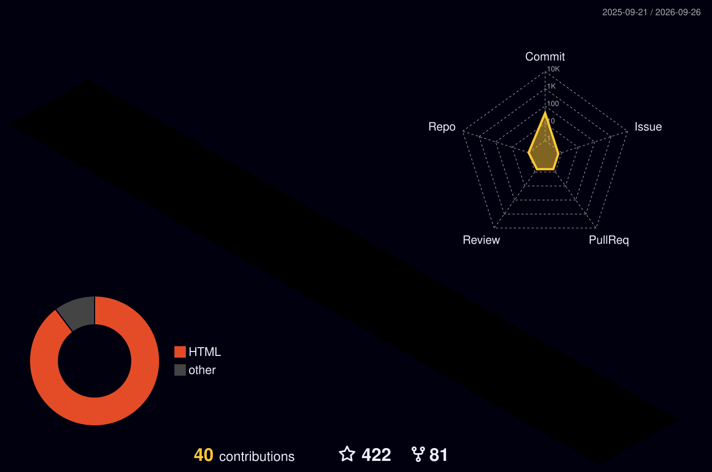

  

  

  <h1>Hi, I'm Qiaolin (Chow-lin) Wang </h1>
  <h3>Researcher at <a href="https://bland.ai">Bland</a> · building audio general intelligence</h3>

- 🔭 At Bland I work on expressive ASR, TTS, post-training, and speech-to-speech systems for voice AI in regulated industries.
- 🎓 MS in Electrical Engineering, Columbia University (2026), where I was a research assistant on large audio language models with Prof. Nima Mesgarani. BE in Computer Science, Wuhan University (2024).
- 🛠️ Before that: speech emotion recognition and multitask speech foundation models (Research Engineer intern), and TTS / voice cloning (ML Engineer intern) at WIZ.AI.
- 🏠 Homepage: [qiaolinwang.github.io](https://qiaolinwang.github.io/) · [LinkedIn](https://www.linkedin.com/in/qiaolin-wang-827545337/)
- ⚡ I'm also a hip-hop artist and producer. Find me on NetEase Cloud Music: [Venti_J](https://music.163.com/#/artist?id=37561474)

### 📄 Publications

- **AVMeme Exam: A Multimodal Multilingual Multicultural Benchmark for LLMs' Contextual and Cultural Knowledge and Thinking**, COLM 2026. [arXiv:2601.17645](https://arxiv.org/abs/2601.17645)
- **Layer-wise Minimal Pair Probing Reveals Contextual Grammatical-Conceptual Hierarchy in Speech Representations**, EMNLP 2025 (SAC Highlight). [arXiv:2509.15655](https://arxiv.org/abs/2509.15655)

### 🧰 Tools

  

### 🧊 Contributions in 3D

  

  <picture>
    <source media="(prefers-color-scheme: dark)" srcset="https://raw.githubusercontent.com/qiaolinwang/qiaolinwang/output/snake-dark.svg" />
    
  </picture>

  

  

